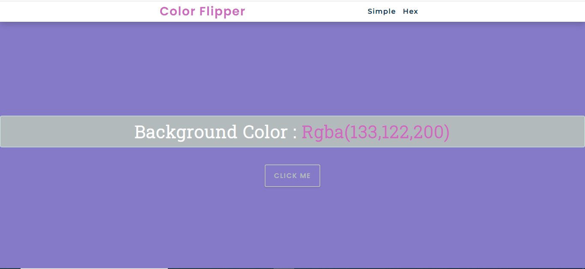
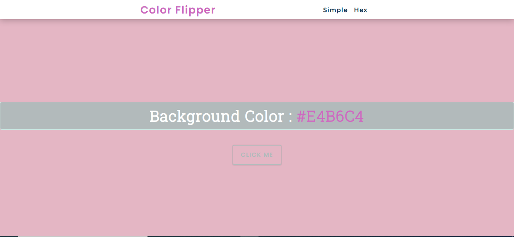
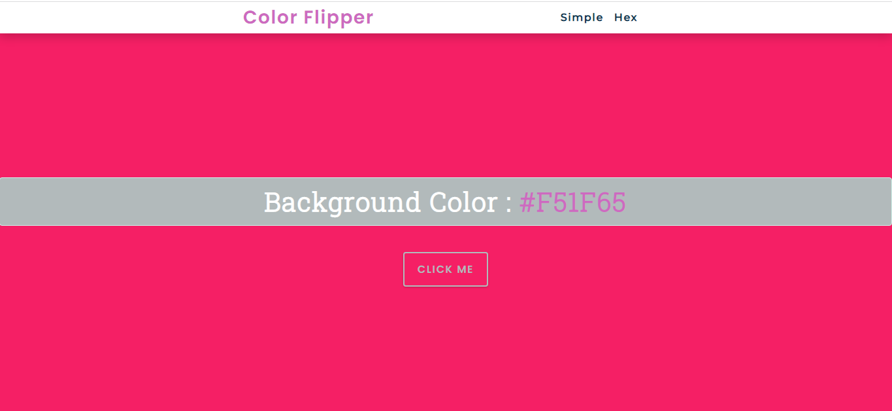
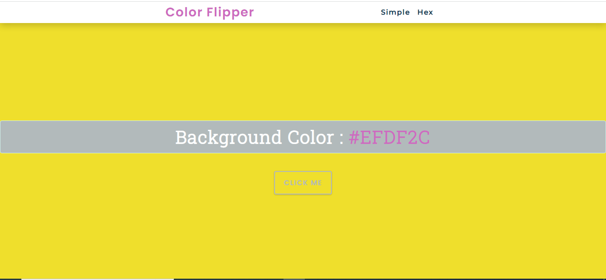

 # Sticky Notes Website

<b>The website contain landing page that displays a centered div with the background color values(named colors , RGB , Hexadecimal) </b>

- <b>you can select the simple section which containes a chosen colors with each value types</b>
- <b>Or you can select the hex section and you can get random colors with hexadecimal values</b>

 
 

  

 

#

• The **Simple** category has [4 chosen color names, rgb and hexadecimal code recognized by CSS].

#

 

• The **Hex** category has randomized hexadecimal color values.

 

 

#

